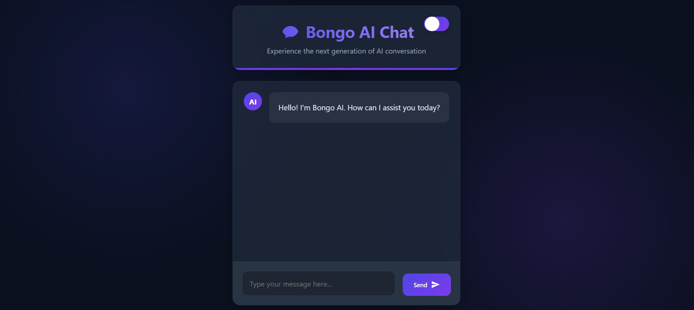

# Bongo AI Chat - Gemini-Powered Chatbot  

🚀 **A sleek, interactive AI chatbot powered by Google's Gemini API**  

  

## 🌟 Features  

✅ **AI-Powered Conversations** - Powered by Google's Gemini API for intelligent responses  
✅ **Modern UI** - Clean, responsive chat interface  
✅ **Easy Integration** - Simple setup with your Gemini API key  
✅ **Lightweight** - Pure HTML/CSS/JS with no frameworks  

## 🛠️ Tech Stack  

### Frontend  
  
  
  

### AI Integration  
  
###  Get API Key  
Visit [Google AI Studio](https://aistudio.google.com/) to get your Gemini API key 

### Deployment  
  

## ⚡ Quick Start  

###  Clone the Repository  
```bash
git clone https://github.com/safal-mondal/SAFAL-AI.git
cd SAFAL-AI
